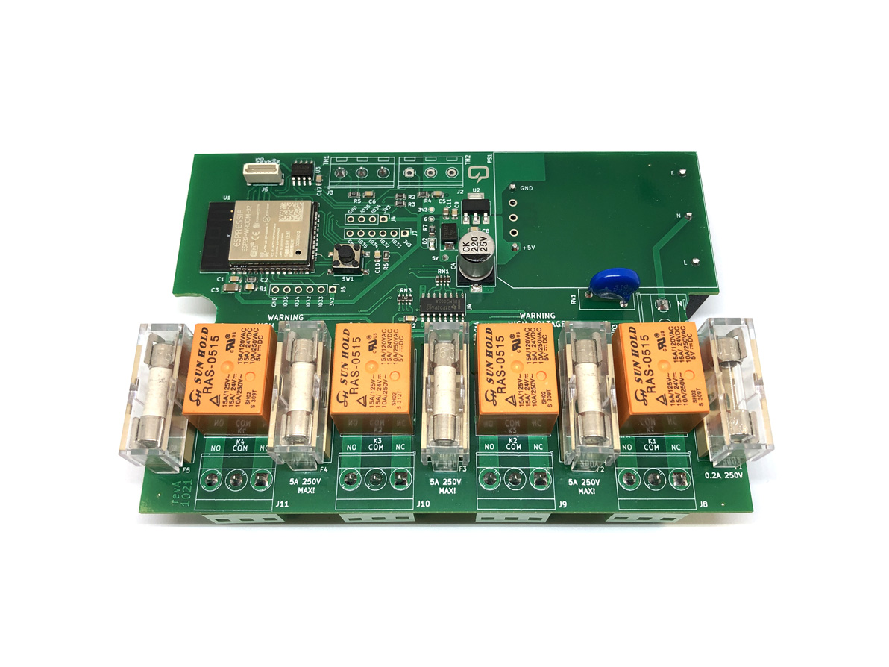

# esp32-aquarium-controller

This project started when a friend of mine which has a snake terrarium asked for my help to build a system that is capable of regulating temperature and humidity so the snake can live in optimum conditions. I’m not necessarily a snake lover, I would rather stay away from these kinds of creatures but that doesn’t stop me from helping my friend.

The ESP32 module is the core of this board and it serves as a central processor taking in sensor data and deciding when to switch on/off the 4 relay controlled outputs to adjust the environment inside the aquarium/terrarium.

If you would like to order one of these boards ready assembled, check out my [Tindie store](https://www.tindie.com/products/voltlog/esp32-aquarium-terrarium-controller/).

More info about this project in [Voltlog #361](https://youtu.be/Hlmbx2yu9M0).

Known issues in revA:
- Power brick module footprint is wrong so it needs to be installed on the bottom side of the board. 
- There are no mounting holes.
- Fitting the board inside the intended enclosure required some adjustments on the round cutouts. This is something to consider if you want to use the same enclosure but if you plan to install this in a larger plastic enclosure, it shouldn't be a problem.

